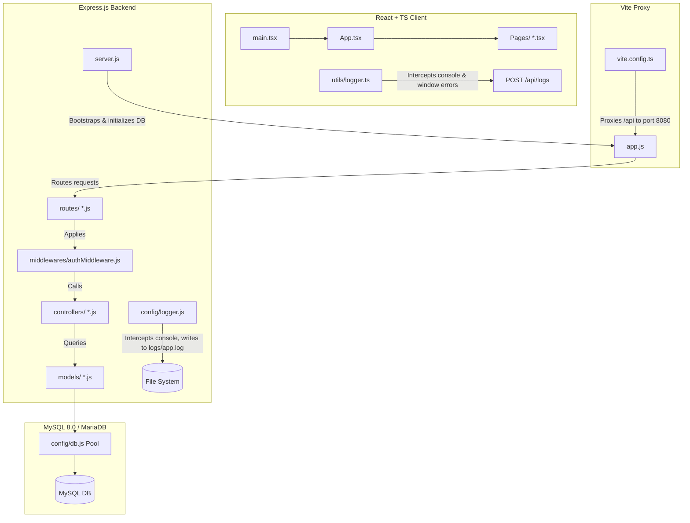

# Technical Code Flow & Concepts Documentation

This document describes the end-to-end code flow, architecture, and core patterns of the **TechCompatibility Portal** application (excluding the `Archive` folder). It includes file paths, line numbers, and actual code snippets to map out how requests propagate through the system.

---

## 🗺️ System Architecture Overview

The system follows a classic **Client-Server-Database** architecture with a centralized logging pipeline. The frontend React app is served by Vite, which proxies API requests to an Express.js Node server that talks to MySQL.



---

## 🪵 1. Unified Logging Pipeline (Cross-Cutting Concern)

The application features a unique logging mechanism where both backend logs and frontend console outputs/runtime errors are intercepted and consolidated in a single backend file (`logs/app.log`).

### A. Frontend Logger Interception
The frontend overrides the browser's native `console.log`, `console.warn`, and `console.error` methods, and sets up event listeners for uncaught errors and promise rejections.

*   **File Path**: [`frontend/src/utils/logger.ts`](file:///home/hemonesh-maheshwari/Desktop/New_tech_demo/frontend/src/utils/logger.ts)
*   **Lines 61-73** (Uncaught Error Handlers):
```typescript
// Capture global uncaught runtime errors
window.addEventListener('error', (event) => {
  const errorObj = event.error;
  const message = errorObj ? (errorObj.stack || errorObj.message) : event.message;
  sendLogToServer('ERROR', [`Uncaught Runtime Error: ${message}`]);
});

// Capture unhandled promise rejections
window.addEventListener('unhandledrejection', (event) => {
  const reason = event.reason;
  const message = reason instanceof Error ? (reason.stack || reason.message) : String(reason);
  sendLogToServer('ERROR', [`Unhandled Promise Rejection: ${message}`]);
});
```

*   **Lines 8-43** (Uploading to Server):
    The `sendLogToServer` function sends the details back to the Node backend using a `fetch` POST request:
```typescript
function sendLogToServer(level: 'INFO' | 'WARN' | 'ERROR', args: unknown[]) {
  if (isSending) return; // Prevent loops if fetch itself logs anything

  // Format arguments into a readable string
  const message = args
    .map((arg) => {
      if (arg instanceof Error) {
        return arg.stack || arg.message;
      }
      if (typeof arg === 'object' && arg !== null) {
        try {
          return JSON.stringify(arg);
        } catch {
          return String(arg);
        }
      }
      return String(arg);
    })
    .join(' ');

  isSending = true;

  fetch('/api/logs', {
    method: 'POST',
    headers: {
      'Content-Type': 'application/json',
    },
    body: JSON.stringify({ level, message }),
  })
    .catch((err) => {
      originalError('[Logger] Failed to send log to backend:', err);
    })
    .finally(() => {
      isSending = false;
    });
}
```

### B. Backend Log Handling
When the frontend logs are posted to `/api/logs`, the backend intercepts them and routes them through its own console methods.

*   **File Path**: [`backend-node/src/app.js`](file:///home/hemonesh-maheshwari/Desktop/New_tech_demo/backend-node/src/app.js)
*   **Lines 25-39**:
```javascript
// Route for receiving frontend logs
app.post('/api/logs', (req, res) => {
  const { level, message } = req.body;
  const prefixedMessage = `[Front-End] ${message}`;

  if (level === 'ERROR') {
    console.error(prefixedMessage);
  } else if (level === 'WARN') {
    console.warn(prefixedMessage);
  } else {
    console.log(prefixedMessage);
  }

  res.sendStatus(204);
});
```

The backend consoles are themselves intercepted by `logger.js` which appends timestamps and writes the logs to `logs/app.log` in addition to outputting them to standard streams.

*   **File Path**: [`backend-node/src/config/logger.js`](file:///home/hemonesh-maheshwari/Desktop/New_tech_demo/backend-node/src/config/logger.js)
*   **Lines 29-48**:
```javascript
// Override console.log
console.log = function (...args) {
  const formatted = formatLog('INFO', args);
  logStream.write(formatted);
  originalLog.apply(console, args);
};

// Override console.error
console.error = function (...args) {
  const formatted = formatLog('ERROR', args);
  logStream.write(formatted);
  originalError.apply(console, args);
};

// Override console.warn
console.warn = function (...args) {
  const formatted = formatLog('WARN', args);
  logStream.write(formatted);
  originalWarn.apply(console, args);
};
```

---

## 🚀 2. Backend Bootstrapping & DB Initialization Flow

When the backend node application starts up, it connects to the database, performs schema creation, seeds initial data, runs any needed migrations, and then binds to the network interface.

### A. Initialization Orchestration
*   **File Path**: [`backend-node/src/server.js`](file:///home/hemonesh-maheshwari/Desktop/New_tech_demo/backend-node/src/server.js)
*   **Lines 10-24**:
```javascript
async function startServer() {
  try {
    // Initialize the DB table if it doesn't exist
    await LemfModel.initializeTable();

    app.listen(PORT, '0.0.0.0', () => {
      console.log(`Server is running on port ${PORT}`);
    });
  } catch (err) {
    console.error('Failed to start server:', err);
    process.exit(1);
  }
}
```

### B. Database Connection Setup
The database configuration parses JDBC URLs (for compatibility with Spring setups) or fallback variables into a database connection configuration pool.

*   **File Path**: [`backend-node/src/config/db.js`](file:///home/hemonesh-maheshwari/Desktop/New_tech_demo/backend-node/src/config/db.js)
*   **Lines 20-37**:
```javascript
const jdbcParsed = parseJdbcUrl(process.env.SPRING_DATASOURCE_URL);

const dbConfig = {
  host: jdbcParsed?.host || process.env.DB_HOST || 'localhost',
  port: jdbcParsed?.port || parseInt(process.env.DB_PORT || '3306', 10),
  user: process.env.SPRING_DATASOURCE_USERNAME || process.env.DB_USER || 'pot_user',
  password: process.env.SPRING_DATASOURCE_PASSWORD || process.env.DB_PASSWORD || 'pot_pass',
  database: jdbcParsed?.database || process.env.DB_NAME || 'pot_db',
  waitForConnections: true,
  connectionLimit: 10,
  queueLimit: 0
};

console.log(`Connecting to database at ${dbConfig.host}:${dbConfig.port}/${dbConfig.database} as ${dbConfig.user}`);

const pool = mysql.createPool(dbConfig);

module.exports = pool;
```

### C. Database Migration & Seeding
The database schema and administrative users are set up during start-up. In addition, there is migration logic that handles hashing plaintext passwords.

*   **File Path**: [`backend-node/src/models/lemfModel.js`](file:///home/hemonesh-maheshwari/Desktop/New_tech_demo/backend-node/src/models/lemfModel.js)
*   **Lines 18-77** (`initializeTable`):
```javascript
  static async initializeTable() {
    const query = `
      CREATE TABLE IF NOT EXISTS lemf_records (
        id BIGINT AUTO_INCREMENT PRIMARY KEY,
        name VARCHAR(100) NOT NULL,
        category VARCHAR(50),
        assigned_to VARCHAR(100),
        notes VARCHAR(500),
        status VARCHAR(20) DEFAULT 'PENDING',
        created_at TIMESTAMP DEFAULT CURRENT_TIMESTAMP
      );
    `;
    const loginQuery = `
      CREATE TABLE IF NOT EXISTS lemf_login_details (
        id INT AUTO_INCREMENT PRIMARY KEY,
        username VARCHAR(100) NOT NULL UNIQUE,
        password VARCHAR(255) NOT NULL
      );
    `;
    try {
      await db.query(query);
      console.log('lemf_records table initialized successfully.');
      
      await db.query(loginQuery);
      console.log('lemf_login_details table initialized successfully.');

      // Check if created_by column exists
      const [cols] = await db.query(
        "SELECT COLUMN_NAME FROM INFORMATION_SCHEMA.COLUMNS WHERE TABLE_SCHEMA = DATABASE() AND TABLE_NAME = 'lemf_records' AND COLUMN_NAME = 'created_by'"
      );
      if (cols.length === 0) {
        await db.query("ALTER TABLE lemf_records ADD COLUMN created_by INT NULL");
        await db.query("ALTER TABLE lemf_records ADD CONSTRAINT fk_created_by FOREIGN KEY (created_by) REFERENCES lemf_login_details(id) ON DELETE SET NULL");
        console.log("Added created_by column and foreign key constraint successfully.");
      }
      
      const [users] = await db.query('SELECT COUNT(*) as count FROM lemf_login_details');
      if (users[0].count === 0) {
        const hashedPassword = await bcrypt.hash('admin123', 10);
        await db.query(
          "INSERT INTO lemf_login_details (username, password) VALUES ('admin', ?)",
          [hashedPassword]
        );
        console.log('Seeded default admin user (username: admin) with hashed password.');
      } else {
        // Migration: check if 'admin' password is plain text and migrate to hash
        const [adminRows] = await db.query("SELECT * FROM lemf_login_details WHERE username = 'admin'");
        if (adminRows.length > 0) {
          const adminUser = adminRows[0];
          const isHashed = adminUser.password.startsWith('$2a$') || adminUser.password.startsWith('$2b$') || adminUser.password.startsWith('$2y$');
          if (!isHashed) {
            const hashedPassword = await bcrypt.hash(adminUser.password, 10);
            await db.query(
              "UPDATE lemf_login_details SET password = ? WHERE id = ?",
              [hashedPassword, adminUser.id]
            );
            console.log('Migrated existing plaintext admin password to hashed format.');
          }
        }
      }
    } catch (err) {
      console.error('Error initializing tables:', err);
      throw err;
    }
  }
```

---

## 🔒 3. Authentication & Authorization Flow

The application uses stateful login checks on the frontend stored in local storage, paired with Stateless **JSON Web Token (JWT)** verification for API requests.

### A. Frontend Form Submission
*   **File Path**: [`frontend/src/Pages/login.tsx`](file:///home/hemonesh-maheshwari/Desktop/New_tech_demo/frontend/src/Pages/login.tsx)
*   **Lines 15-30**:
```typescript
  const handleSubmit = async (event: React.FormEvent<HTMLFormElement>) => {
    event.preventDefault();
    setError('');
    setLoading(true);

    try {
      const success = await onLogin(username, password);
      if (!success) {
        setError('Invalid username or password.');
      }
    } catch {
      setError('An error occurred. Check your server connection.');
    } finally {
      setLoading(false);
    }
  };
```

### B. Backend JWT Issue
The backend checks the database, uses `bcrypt.compare` to verify the password, and returns a JWT that expires in 10 minutes.

*   **File Path**: [`backend-node/src/controllers/authController.js`](file:///home/hemonesh-maheshwari/Desktop/New_tech_demo/backend-node/src/controllers/authController.js)
*   **Lines 17-39**:
```javascript
    const user = await AuthModel.findByUsername(username);
    const isMatch = user ? await bcrypt.compare(password, user.password) : false;
    if (!user || !isMatch) {
      console.warn(`Login failed: Invalid credentials for username: "${username}".`);
      return res.status(401).json({ error: 'Invalid username or password' });
    }

    const token = jwt.sign(
      { id: user.id, username: user.username },
      JWT_SECRET,
      { expiresIn: '10m' }
    );

    console.log(`Login successful for user ID ${user.id} ("${user.username}"). Token issued.`);

    res.json({
      status: 'success',
      token,
      user: {
        id: user.id,
        username: user.username
      }
    });
```

### C. JWT Middleware Verification
Any API requests going to protected endpoints (like `/api/lemf`) must pass through the authentication middleware which decodes the Bearer token and sets the user payload.

*   **File Path**: [`backend-node/src/middlewares/authMiddleware.js`](file:///home/hemonesh-maheshwari/Desktop/New_tech_demo/backend-node/src/middlewares/authMiddleware.js)
*   **Lines 4-18**:
```javascript
module.exports = (req, res, next) => {
  try {
    const authHeader = req.headers.authorization;
    if (!authHeader || !authHeader.startsWith('Bearer ')) {
      return res.status(401).json({ error: 'Access denied. No token provided.' });
    }

    const token = authHeader.split(' ')[1];
    const decoded = jwt.verify(token, JWT_SECRET);
    req.user = decoded; // Contains id, username
    next();
  } catch (err) {
    return res.status(401).json({ error: 'Invalid or expired token.' });
  }
};
```

### D. Session Expiration Handling
If a request returns a `401 Unauthorized` response, the frontend clears storage credentials and redirects to the login view.

*   **File Path**: [`frontend/src/App.tsx`](file:///home/hemonesh-maheshwari/Desktop/New_tech_demo/frontend/src/App.tsx)
*   **Lines 40-48**:
```typescript
  const handleSessionExpired = () => {
    setIsLoggedIn(false);
    setUser('');
    localStorage.removeItem('isLoggedIn');
    localStorage.removeItem('username');
    localStorage.removeItem('token');
    setToast({ message: 'Session expired. Please log in again.', type: 'error' });
    setTimeout(() => setToast(null), 5000);
  };
```

---

## 📋 4. Core LEMF Records CRUD Flow

Below is the execution flow trace for creating a LEMF database record.

### Step 1: Frontend Form Input & Submission
The user enters details into `CreateLemf` component form and submits.

*   **File Path**: [`frontend/src/Pages/create_lemf.tsx`](file:///home/hemonesh-maheshwari/Desktop/New_tech_demo/frontend/src/Pages/create_lemf.tsx)
*   **Lines 35-44**:
```typescript
      <form onSubmit={handleSubmit}>
        <div className="form-grid">
          <label>
            Lemf Name
            <input
              value={form.name}
              onChange={(event) => setForm({ ...form, name: event.target.value })}
              required
            />
          </label>
```

### Step 2: API POST Request
`App.tsx` handles `handleSubmit` by appending the JWT Bearer token into headers and sending the form payload as a JSON POST request.

*   **File Path**: [`frontend/src/App.tsx`](file:///home/hemonesh-maheshwari/Desktop/New_tech_demo/frontend/src/App.tsx)
*   **Lines 231-255**:
```typescript
  const handleSubmit = async (event: React.FormEvent<HTMLFormElement>) => {
    event.preventDefault();
    try {
      const token = localStorage.getItem('token');
      const response = await fetch('/api/lemf', {
        method: 'POST',
        headers: {
          'Content-Type': 'application/json',
          'Authorization': `Bearer ${token}`
        },
        body: JSON.stringify({
          name: form.name,
          category: form.category,
          assignedTo: form.assignedTo,
          notes: form.notes,
          status: form.status,
        }),
      });
      if (response.status === 401) {
        handleSessionExpired();
        return;
      }
      if (!response.ok) throw new Error('Failed to save');
      const saved = await response.json() as LemfRecord;
```

### Step 3: Express Routing
The request hits `lemfRoutes.js` routing table, is validated by the auth middleware, and is forwarded to `lemfController.create`.

*   **File Path**: [`backend-node/src/routes/lemfRoutes.js`](file:///home/hemonesh-maheshwari/Desktop/New_tech_demo/backend-node/src/routes/lemfRoutes.js)
*   **Lines 6-7**:
```javascript
router.get('/', authMiddleware, lemfController.list);
router.post('/', authMiddleware, lemfController.create);
```

### Step 4: Controller Validation & Model Invocation
The controller parses request details, validates constraints, maps credentials, and runs model execution.

*   **File Path**: [`backend-node/src/controllers/lemfController.js`](file:///home/hemonesh-maheshwari/Desktop/New_tech_demo/backend-node/src/controllers/lemfController.js)
*   **Lines 14-36**:
```javascript
exports.create = async (req, res, next) => {
  try {
    const { name, category, assignedTo, notes, status } = req.body;
    const creator = req.user ? req.user.username : 'anonymous';
    console.log(`Attempting to add new LEMF record. User: "${creator}". Data:`, { name, category, assignedTo, status });

    if (!name || name.trim() === '') {
      console.warn('LEMF record creation failed: Name is empty.');
      return res.status(400).json({ error: 'Name is required' });
    }

    const saved = await LemfModel.create({
      name: name.trim(),
      category: category || null,
      assignedTo: assignedTo || null,
      notes: notes || null,
      status: status && status.trim() !== '' ? status.trim() : 'PENDING',
      createdBy: req.user ? req.user.id : null
    });
```

### Step 5: MySQL Database Insert
The database model executes parameterized queries using the connection pool, fetches the newly generated row, and maps it back to a standard JavaScript DTO representation.

*   **File Path**: [`backend-node/src/models/lemfModel.js`](file:///home/hemonesh-maheshwari/Desktop/New_tech_demo/backend-node/src/models/lemfModel.js)
*   **Lines 90-110**:
```javascript
  static async create(data) {
    const query = `
      INSERT INTO lemf_records (name, category, assigned_to, notes, status, created_by, created_at)
      VALUES (?, ?, ?, ?, ?, ?, ?)
    `;
    const values = [
      data.name,
      data.category || null,
      data.assignedTo || null,
      data.notes || null,
      data.status || 'PENDING',
      data.createdBy || null,
      new Date()
    ];
    const [result] = await db.query(query, values);
    const insertId = result.insertId;

    // Fetch and return the newly created record
    const [rows] = await db.query('SELECT * FROM lemf_records WHERE id = ?', [insertId]);
    return LemfModel.mapRowToDto(rows[0]);
  }
```

### Step 6: Frontend State Synced
The backend responds with the saved DTO. `App.tsx` receives it, updates its state array, displays a success notification toast, clears the form, and updates navigation.

*   **File Path**: [`frontend/src/App.tsx`](file:///home/hemonesh-maheshwari/Desktop/New_tech_demo/frontend/src/App.tsx)
*   **Lines 255-261**:
```typescript
      const saved = await response.json() as LemfRecord;
      setRows((current) => [saved, ...current]);
      setSelectedRecord(saved);
      setMessage(`Saved ${saved.name} to MySQL.`);
      setToast({ message: `Successfully created entry "${saved.name}"!`, type: 'success' });
      setTimeout(() => setToast(null), 3000);
      setForm(emptyForm);
      navigateTo('details');
```

---

## 🔀 5. Vite Development API Proxying

To avoid browser **CORS (Cross-Origin Resource Sharing)** issues during local development (where React dev server is at port `5173` and Express is at port `8080`), Vite is configured with a built-in proxy. It catches requests starting with `/api` and forwards them silently to `http://localhost:8080`.

*   **File Path**: [`frontend/vite.config.ts`](file:///home/hemonesh-maheshwari/Desktop/New_tech_demo/frontend/vite.config.ts)
*   **Lines 7-17**:
```typescript
  server: {
    host: true,
    port: 5173,
    proxy: {
      '/api': {
        target: 'http://localhost:8080',
        changeOrigin: true,
      },
    },
  },
```
This is why all frontend fetch requests simply query paths like `/api/lemf` directly.
